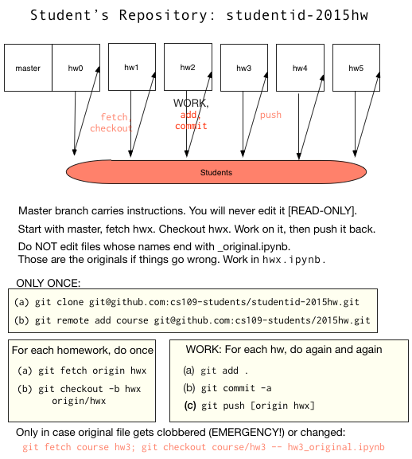

# 2015hw

##hw1

You MAY NOT share this repository to the public.

Let me describe the steps by which you gain access to the homework.

1. Our read-only repository is `cs109-students/2015hw`. All students have read-only access to this repository. You can see this homework there under the "hw1" branch. Any changes after the homework has gone out will be made here.
2. You will have your own read-write repository under the `cs109-students` organization, which will be of the form `cs109-students/githubusername-2015hw`. Only you and the cs109 staff have access to this repository, thus ensuring the privacy of your homework.
3. This homework is on the hw1 branch. There is `master` branch too, which will have some instructions, but nothing very exciting. You will never work on this branch.

On the assumption that you followed the appropriate flow for the hw0 branch and have a master and a hw0 branch currently on your computer, this is what you do:

1. Do `git fetch origin hw1`, which fetches from *your* remote repository (named `origin`) on github the `hw1` branch. Then you issue `git checkout -b hw1 origin/hw1`. This command makes a new local branch `hw1` on your machine which tracks the `hw1` branch on your remote.
2. You are now in the `hw1` branch. This is where you will work on homework 1. Start the ipython notebook in the repository and run the homework. The file you will use is `hw1.ipynb`. DO NOT run the notebook ending in `_original.ipynb`. These are simply copies of the homework. We made these copies so that you can update them from our `course` remote in case we make any changes. You will now engage in the "edit/add/commit/push" cycle as described above. (The `push` will only push to the remote `hw1` branch.)
3.. We'll grade the last commit you make before the homework deadline, which is 11:59PM, Thursday, September 24th. We will be looking for the file `hw1.ipynb`.

Once again, in case we make changes, you can incorporate them into your repo by doing: `git fetch course; git checkout course/hw1 -- hw1_original.ipynb`. An "add/commit/push" cycle will make sure these changes go into your fork as well.  If you have already started working, it might be easiest to manually copy the changes into hw1.ipynb. Remember, thats the file we are looking for, NOT, `hw1_original.ipynb`

If you are an advanced git user, it might be safer for you to create a branch off the hw1 branch, like say, play-hw1, and work there. You can then merge it in.

This process for all the homework is summarized in the diagram below.

