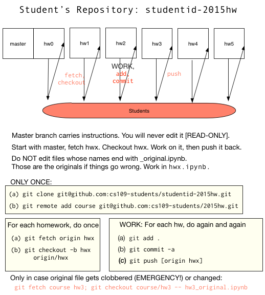

# 2015hw

To make `hw0.ipynb` easily accessible, we added it to the public lab repo, so that you can read it even without having a github account. (Otherwise we would have a chicken and egg problem.). This is because our homework repository is private, and we have set it up so that your repositories are private as well.

Nevertheless, we want you to get acquainted with the workflow you must execute in order to obtain and submit homeworks. 

Let me first describe the steps by which you gain access to the homework.

1. At the beginning of this document you were asked to obtain a github id and enter it in the mandatory survey. We will use this github id to construct a homework repository for you with read-write access, and give you access to our read-only homework repository. You will be added to a github organization `cs109-students`.
2. Our read-only repository is `cs109-students/2015hw`. All students have read-only access to this repository. It will serve the job of the `course` remote, like above. Any changes after the homework has gone out will be made here.
3. You will have your own read-write repository under the `cs109-students` organization, which will be of the form `cs109-students/userid-2015hw`. Only you and the cs109 staff have access to this repository, thus ensuring the privacy of your homework.
4. When each homework is released, we will create a **branch** on your remote repository, `cs109-students/userid-2015hw`. The branches are, unimaginatively named: `hw0`, `hw1`,...,`hw5`. (For the curious, the way this works is by us creating one remote per student for a local clone of our `cs109-students/2015hw` repository, and pushing the new branch to it. We only push to a new branch each time as we dont want to be messing with a branch you have already worked on.). There is `master` branch too, which will have some instructions, but nothing very exciting. You will never work on this branch.

So now, how to you obtain and submit the homework? You wont be forking here.

1. You first make a clone of your repository. From the terminal, you issue the command: `git clone git@github.com:cs109-students/userid-2015hw.git` (for ssh users) or `git clone https://github.com/cs109-students/userid-2015hw.git` (for https users). Substitute your own userid for `userid`.
2. Next you add a remote `course` to track the read-only "guru" repository. The command for this is: `git remote add course git@github.com:cs109-students/2015hw.git` or `git remote add course https://github.com/cs109-students/2015hw.git`. This well help to incorporate any changes, just like above.
3. Your clone will come with a `master` branch, and perhaps a `hw0` branch. In either case you should first do `git fetch origin hw0`, which fetches from *your* remote repository on github the `hw0` branch. Then you issue `git checkout -b hw0 origin/hw0`. This command makes a new local branch `hw0` on your machine which tracks the `hw0` branch on your remote.
4. You are now in the `hw0` branch. This is where you will work on homework 0. Start the ipython notebook in the repository and run the homework. The file you will use is `hw0.ipynb`. DO NOT run the notebook ending in `_original.ipynb`. These are simply copies of the homework. We made these copies so that you can update them from our `course` remote in case we make any changes. You will now engage in the "add/commit/push" cycle as described above. (The `push` will only push to the remote `hw0` branch.)
5. We'll grade the last commit you make before the homework deadline. We will be looking for the file `hw0.ipynb`. (In actuality we wont grade homework 0 but check that you submitted it. But we will be using this mechanism to grade the homeworks from homework 1 onwards.)
6. When we are ready to send out homework 1 to you, we will create a new branch on your remote repository `git@github.com:cs109-students/userid-2015hw.git` on github with the name `hw1`. You will now repeat the process from step 3 onwards: `git fetch origin hw1` followed by `git checkout -b hw1 origin/hw1`. Then you work on the `hw1` branch, and engage in the "add/commit/push" cycle by running `hw1.ipynb`. And so on...

Once again, in case we make changes, you can incorporate them into your repo by doing: `git fetch course; git checkout course/hw0 -- hw0_original.ipynb`. An "add/commit/push" cycle will make sure these changes go into your fork as well. If you intend to work on the changed file `hw0_original.ipynb`, simply copy the file to `hw0.ipynb` and work on it. 

Remember that we will be looking for files `hw0.ipynb`, `hw1.ipynb`,...,`hw5.ipynb` as the semester goes on.

This process is summarized in the diagram below.

